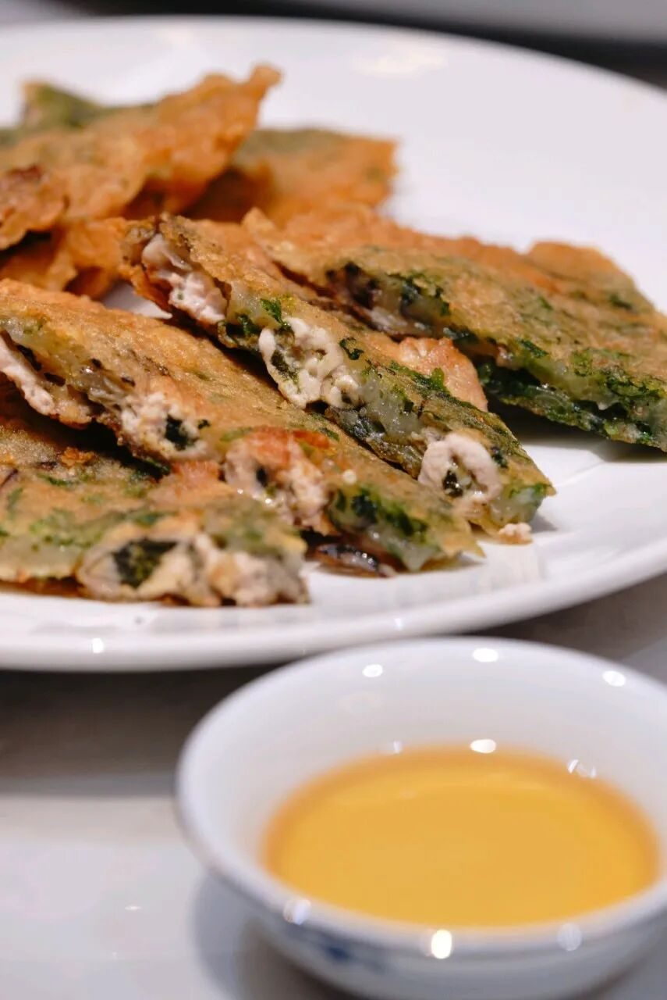

# 沃什的纪律与AI应用狂欢

**一、闲聊几句**

昨晚难得提前达标，所以人在外直播答疑了接近1小时。有人问沃什讲话解读，今晚第四章专门讲。

新进的真爱，一定要先补课：[新粉必读&作业目录](https://mp.weixin.qq.com/s?__biz=Mzk0MTcwMjU1Nw==&mid=2247498449&idx=1&sn=1feb099e1cc39df7713f9668e1c961fb&scene=21#wechat_redirect)

然后再考虑跟不跟，怎么跟，当下的行情绝对不是有个代码知道别人的买卖点这种单变量思维就能挣钱的。

昨晚的文章转发非常高（对比日常的周五）[孙学解读](https://mp.weixin.qq.com/s?__biz=Mzk0MTcwMjU1Nw==&mid=2247499426&idx=1&sn=fa0e91d18f9d5b4a94abe52ebcd65371&scene=21#wechat_redirect)，还是那句话，吃瓜可以，但还是要谨记，取精华去糟粕要记住这句话：

承认世界是多维度竞争、承认变化速度，拒绝"没房子所以单身"这种单变量因果思维。富人思维的核心就是承认多变量，而单变量方式理解世界的人，只能失败。

作业帖还在写，预计今晚要搞得很晚，争取明天推送，因为整个8月都无写作业帖，因为把2篇整合到一起：

要先做一个产业革命牛市见顶过程的历史回测，然后才聊接下来的交易。

若忙得过来，周末复盘会在二更，没有“星标”和日常互动少的朋友可能会miss掉（公众号规定，一天只能有一条推送是带提醒的）。

**二、今日视频**

**职场必读：越有用，越危险**

**三、昨日复盘**

**1、指数**

四大股指集体收跌，沪指微跌、深成指小阴、创业板指中阴、科创综指中阴。日内冲高回落，早盘一度冲高，随后一路跳水，尾盘两点扩大跌幅。成交2.12wy，较前日缩量232y。3013只上涨、2390只下跌，涨跌比约1.3:1，82只涨停、2只跌停。英伟达财报刺激效力消退，市场等待沃什杰克逊霍尔讲话，资金转向防御。港股方面，恒指-0.34%、恒科-0.13%。

**2、主线强弱排序**

**农业（万向、新赛、敦煌、黑芝）＞化工（金牛、赤天、泸天）＞PTFE（昊华、沃特）＞网络安全（麒麟、中安、天融）＞AI应用（鼎捷、天娱）**

拖累方向：半导体、创新药、CRO、算力硬件、消费电子

科技成长退潮，农业防御属性凸显，资金高低切换明显。

**3、农业板块**

农业股逆势大涨，万向4连板（9天6板），新赛2连板，敦煌、黑芝涨停。消息面上，摩根大通警告下一轮全球粮食危机可能正在酝酿，霍尔木兹海峡航运中断及潜在超强厄尔尼诺或削弱农作物产量，食品通胀可能在2027年上半年持续高企。金健10天6板后今日巨量换手45.07%，收涨9.18%，公司公告称题材预期对实际经营业绩影响存在较大不确定性。国金证券研报称种植板块景气度底部企稳。

**4、化工板块**

化工板块集体拉升，金牛、赤天、泸天涨停。PTFE概念延续强势，昊华、沃特2连板。主力净流入行业板块前五中化肥、天然气、丁辛醇位列前三。

**5、半导体板块**

半导体板块跌幅居前，超纯跌超-8%，普冉跌超-6%。隔夜美股迈威尔科技财报超预期但盘后大跌近-8%，因年内股价已累涨184%、市场预期过高，且公司预计Q3毛利率将下跌。迈威尔数据中心业务营收+46%至21.72亿美元，但AI定制芯片更显著收入贡献预计2029财年及以后体现，令投资者失望。

**6、创新药/CRO板块**

创新药、CRO概念下挫，万邦、康希等跌超-10%。百花跳水触及跌停，神奇高开低走，医药方向自周三起已陷入调整。

**7、盘面：冲高回落，科技资金流出，流入避险方向等待沃什讲话，板块轮动加速**

## 四、 沃什讲话解读

**1、立场宣示 纪律优先于具体承诺**

沃什开场即以玩笑划定边界，将演讲提纲定义为路线图而非前瞻指引，这一姿态本身已暗示整场讲话的核心基调。**他直言承诺的是纪律而非某个具体决定，把政策灵活性置于市场期待之上。**这种定调并非模糊的中性姿态，而是在双重使命中明确选边，将价格稳定置于就业之前，为后续所有论述奠定了鹰派底色。

**2、技术浪潮 AI作为远景变量而非当下决策依据**

沃什将打漂亮经济置于历史转折点，指出AI进展已远超数年前预期，海量资本涌入AI基础设施，两大领先实验室年化token销售额突破千亿美元，同比增速逾五倍。然而，在抛出生产率跃升、token与劳动力关系、资本分配等一系列深层问题后，他明确将这些议题交由五支专项工作组研究，并刻意划清界限，强调这些研究的结论与当前政策决策无关。**这意味着，尽管AI被定义为潜在新生产要素，但在沃什的政策框架中，技术革命是远景变量，而****非当下利率决策的直接影响因子****。**

**3、方法论批判 前瞻指引作为危机遗产已过保鲜期**

**沃什对前瞻指引展开了系统批判，将其定性为金融危机遗产，认为其在常态时期不仅误导市场，更束缚决策灵活性，2021年对高通胀的迟缓应对即是明证。**他提出镜厅问题，警示美联储与市场互相盯视会导致双向致盲，并明确拒绝给出机械式反应函数，直言泰勒规则之类简单规则靠不住。这一方法论转向的核心在于，央行不应试图通过语言管理来替代政策行动，而应让市场从猜测央行意图转向观察央行实际作为。

**4、原则回归 七条底线划定政策疆域**

在摒弃前瞻指引后，沃什以七条原则重构货币政策框架。百分之二的PCE通胀目标被重申为坚定且固定的承诺，价格稳定不会自动实现，而是央行必须交付的职责。短期利率作为主要工具的地位得到确认，非常规政策被严格限定于真正危机。货币重要这一命题被重新强调，要求关注央行与银行体系创造的货币总量。最终，更安静、更有目的的美联储被定义为更可问责的机构，关键时刻要么有理由要么有结果，这是对预期管理泛滥的明确纠偏。

**5、经济评估 强劲数据与金融条件非限制性的关键判断**

**沃什笔下的经济图景呈现全面强劲。**设备和无形资产投资四个季度同比增长约百分之九，创2021年以来最快增速，今年资本开支增长过半归因AI建设。标普五百企业利润年增逾两成，实际消费增长超百分之二，私人国内最终购买今年增近百分之三。失业率百分之四点一，初请人数接近数十年低位，劳动力市场被判定为符合充分就业。然而，**在这幅强劲图景中，他插入关键判断，信贷和贷款市场几乎看不到政策约束迹象，整体金融条件难以被描述为限制性，这为后续政策收紧提供了合理性铺垫。**

**6、通胀诊断 近端加速与趋势否定的双重警示**

**通胀数据被沃什赋予最重的笔墨。**PCE同比百分之三点七，六个月年化却达百分之四点一，近端呈现加速态势。PCE篮子一百九十九个分项中百分之五十四涨幅超百分之三，疫情前二十年这一比例仅为百分之三十二。即便夏季数据好于预期**，他明确拒绝承认潜在趋势有实质改善。**最有分量的表态在于，六十五个月持续高通胀的责任完全在央行，这理所应当，以及必须确信潜在通胀正清晰地以足够快的速度回到目标，否则还有工作要做。这些措辞不仅延续了杰克逊霍尔鹰派传统，更将通胀回落的举证责任完全压向数据本身。

**7、政策信号 定调鹰派与数据依赖的微妙平衡**

综合全个讲话，**沃什的鹰派属性体现在明确选边、否定金融条件限制性、拒绝承认通胀趋势改善、通篇无降息论据，以及还有工作要做的传统措辞。****但他并未承诺九月加息，而是将扳机留给九月四日非农和九月十一日CPI两份数据，同时承认中期通胀预期仍然锚定，并回避长端美债抛售与财政部扩债回购等敏感话题。**这种姿态可定义为定调鹰而非行动鹰，口头拒绝反应函数的同时，通胀未清晰加速回落则还有工作要做的逻辑本身已构成半个反应函数。讲话前市场对九月加息定价仅约三成，此番表态将加息大门撑得更开，却把决定权明牌交给了即将到来的数据。

**8、市场悖论 鹰派讲话与股市探底拉升的背离**

**沃什讲话后美国股市反应并非单向承压，而是探底拉升，****尤其AI软件板块暴涨。**市场可能将沃什对AI基础设施投资的强调解读为技术周期的资本红利，抑或认为鹰派定调已被充分定价，而数据依赖的表态反而保留了政策灵活性。无论何种解释，沃什成功地在强化通胀纪律的同时，避免了对风险资产的直接冲击，这或许是其拒绝机械式前瞻指引的意外副产品。

## 五、一些催化及信息

##

**1、三部门印发《关于完善商品住房销售制度的通知》**

住j部、自然z源部、金融j管z局联合印发通知，部署商品住房销售制度改革。预售项目单体建筑应完成主体结构封顶；购房资金全部存入主办银行监管账户；新出让土地项目优先选择现房销售，实现"所见即所得"；推行"交房即交证"。

**2、央行、金融J管Z局联合印发房地产信贷管理意见**

《关于改革完善房地产信贷管理 推动加快构建房地产发展新模式的意见》:个人住房贷款期限由最长30年延长至40年；建立开发贷款主办银行制；延后个人住房贷款发放时点，确保"能拿房、再还贷"；给予银行债务重组更大自主权。

**3、金融监管总局发布5个房地产融资管理办法**

金融监管总局发布《商品住房开发贷款管理办法（试行）》《个人住房贷款管理办法（试行）》《商业地产贷款管理办法（试行）》《城市更新项目贷款管理办法（试行）》《信托公司开展房地产领域信托业务管理办法（试行）》。个人住房贷款借款人收入偿债比例上限从55%提升至60%；预售项目开发贷最长5年，现售项目最长7年。

**4、证监会发布《关于资本市场支持构建房地产发展新模式的意见》**

证监会支持上市房企通过定向增发、定向可转债等方式再融资；支持上市房企收购涉房资产；支持房企发行公司债券、CMBS、不动产ABS；支持发行REITs或作为扩募资产装入已上市REITs。已有4只商业不动产REITs上市，募资超200y；另有7只获批发行中，16只在审，合计募资超850y。

**5、财政部等三部门规范限售股转让个税政策**

财政部、税务总局、证监会发布公告，个人转让上市公司限售股所得按"财产转让所得"适用20%税率。上市公司申请初始登记时未申报成本原值的，按转让收入全额20%预扣预缴；公告实施前已办理初始登记且未申报的，可按转让收入15%核定成本原值。

**6、发改委研究完善"六张网"多元化投融资模式**

发改委召开系列专题会议，研究完善"六张网"（算力网、新型电网、新一代通信网等）多元化投融资模式，建立"2+3+N"协调机制（2家电网、3家电信运营商、若干家算力企业）。同时印发《物流网建设实施方案》，"十五五"期间计划改造提升约1000个主要货运多式联运节点。

**7、发改委加速具身智能在真实场景中落地**

发改委将统筹布局具身智能实训场，构建高质量真机数据采集系统；建好用好具身智能方向国家人工智能应用中试基地，加速在制造、医疗、消费、服务、公共安全等领域落地应用。

**8、康佳拟主动退市**

康佳拟以股东会决议方式主动撤回A股和B股上市交易，转入退市板块。2025年度经审计期末净资产为负值，已被实施退市风险警示。A股现金选择权行权价2.48元/股，B股0.73港元/股。股权登记日9月22日。

**9、药购董事长因信披问题引咎辞职**

药购董事长兼总经理陈顺军因向公司及审计机构提供关联方信息存在遗漏，引咎辞职。周跃武接任董事长兼总经理，直接持有330万股占3.45%。

**10、美的上半年营收2610.5y+3.5%，净利润264.5y+1.7%**

美的上半年营收2610.5y+3.5%，归母净利润264.5y+1.7%。拟10派5元，派现37.24y。上市以来累计派现超1700y，累计回购超450y为A股最高。智能家居营收1743.41y占67.04%；楼宇科技营收216.25y+10.84%，数据中心液冷业务全面突破；工业技术数据中心及储能热管理核心零部件收入+66%。

**11、腾讯发布Hy4 preview大模型，总参数量770B**

腾讯发布Hy4 preview，总参数量770B，激活参数49B，上下文长度突破1M。输入6元/百万tokens，输出18元/百万tokens，缓存命中0.3元/百万tokens。腾讯Q2资本开支528y+176%，自由现金流首次转负。WorkBuddy/CodeBuddy将开展2周限时免费。

**12、老板上半年净利润5.78y，AI厨电销售额+53%**

老板上半年营收39.72y，净利润5.78y。AI厨电销售额同比+53%，"食神"App用户超800万，Token总消耗量38.8y同比+77倍。追加投资2y建设烹饪智能体研究院。中期拟10派5元，预计年内现金分红合计9.45y。

**13、新华上半年净利润227.9y+54%，年化总投资收益率6.7%**

新华上半年总投资收益575y+27%，归母净利润227.9y+54%。投资规模超1.9wy，较上年末+3.3%。服务实体经济投资余额超1.4wy+15%，科技金融投资余额超2200y。累计投资"长期资金改革试点"基金462.5y，长期持有伊利、电信、陕煤等高股息龙头。

**14、华为徐直军：鸿蒙终端设备突破8000万，Q4将破1亿**

华为轮值董事长徐直军在2026鸿蒙生态大会上透露，装载HarmonyOS 6的终端设备已突破8000万，预计Q4内突破1亿。鸿蒙原生应用突破10万个，HarmonyOS手机上可获取应用超40万个。2026年上半年华为以20.6%市场份额位居中国市场发货量榜首，出货约2760万台+19.4%。

**15、两协会发布券商交易外接管理规范**

中证协与中基协联合发布《证券公司交易信息系统接入管理规范（试行）》，要求券商对交易信息系统接入实现全程管理、穿透管理，公平对待接入客户，不得为特定客户提供差异化安排。私募基金管理人接入需满足登记满一年、具备合规风控部门等条件。

**16、标普维持中国主权信用评级"A+"，展望"稳定"**

标普维持中国主权信用评级"A+"及展望"稳定"。财Z部表示欢迎，称该结果充分肯定中国宏观经济韧性、财政运行稳健性和风险防控有效性。IMF上调2026年中国经济增长预期至4.6%。

**17、地方附加税法公开征求意见**

财Z部会同税务总局起草《中华人民共和国地方附加税法（征求意见稿）》，将城市维护建设税、教育费附加、地方教育附加合并为地方附加税，实行11%-13%幅度税率。

**18、雪盐重大资产重组，停牌前涨停**

雪盐拟重大资产重组，8月28日股价涨停报6.04元，总市值99.06y，下周一停牌。

**19、吉利德HIV新药获FDA批准**

FDA批准吉利德科学HIV新药Bixlenvo，为美国首款针对大多数正在接受复杂治疗方案患者的单片复方制剂，可将每日多片简化至每日一片。每30天用量定价4595美元。吉利德涨0.17%。

**20、Anthropic拟9月7日后公布招股书，最快9月底上市**

Anthropic计划在9月7日美国劳动节后公开IPO招股书，可能于9月下旬或10月初上市。已于6月1日向SEC秘密提交S-1申请。累计融资至少1300亿美元，预计上市融资规模将超过SpaceX今年6月IPO。计划于9月中旬举行投资者日。

**21、美G总T暗示或制裁与伊朗往来中资银行**

美G总T暗示美国政府将可能制裁仍与伊朗保持业务往来的中资银行，以进一步孤立伊朗。外J部发言人表示，中方反对非法单边制裁的立场是一贯的明确的。

**22、英伟达129亿美元收购Hugging Face**

英伟达以129亿美元收购AI开源模型和数据集托管平台Hugging Face，旨在掌控开源AI生态"分发入口"。NBA球星杜兰特曾参与其种子轮和A轮融资，投资回报率达240倍。

**以上**

一口蚝仔烙

---
原文链接：https://mp.weixin.qq.com/s?__biz=Mzk0MTcwMjU1Nw%3D%3D&mid=2247499433&idx=1&sn=ca2fdd8998bd3f2d46563a90ff86836a&chksm=c35627b7303f91f27aa58106a4530afd1c109267b7c8e7fe80c6758272caf9631ff29694e9d8
