# 美债收益率破顶与股市的走向：四次历史回测与当前局面解析（3）

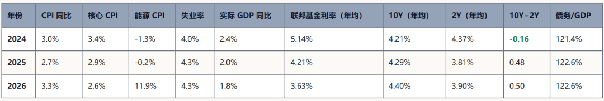

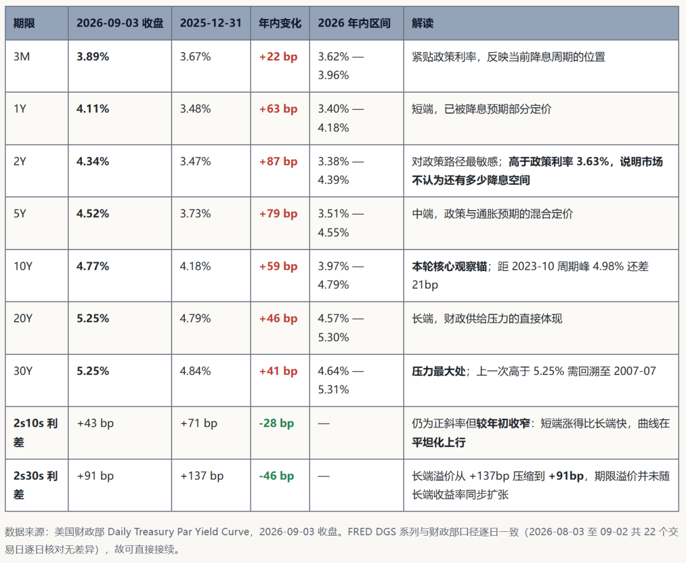

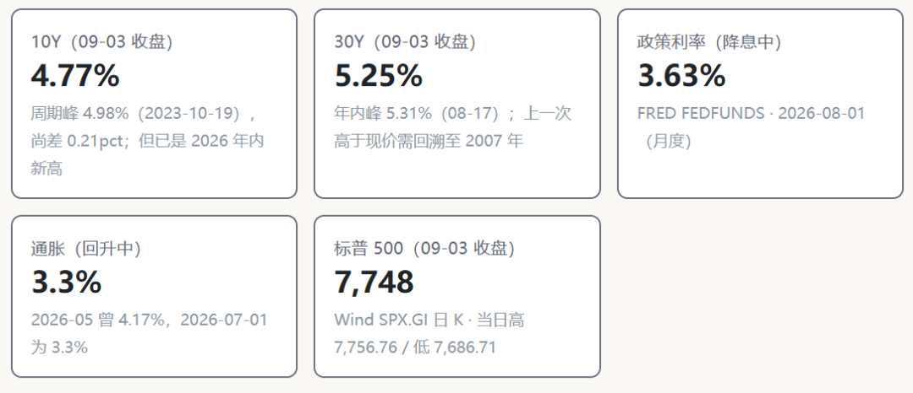

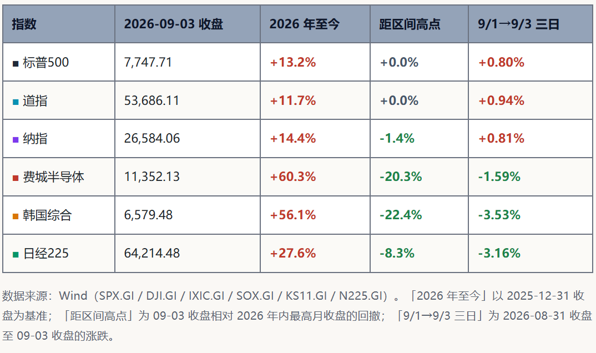

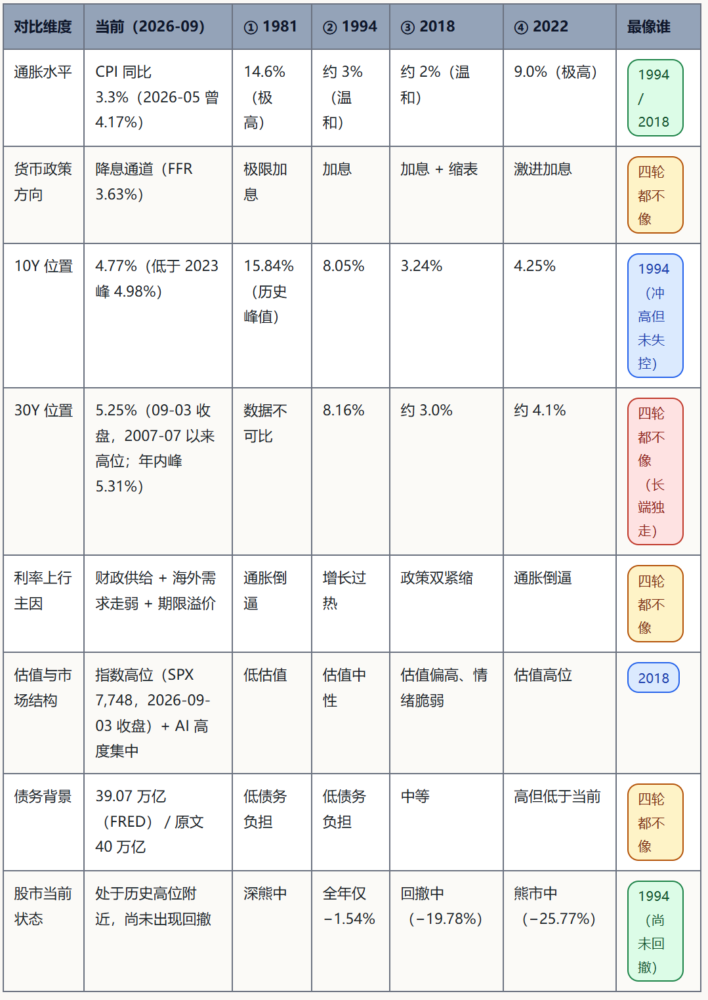

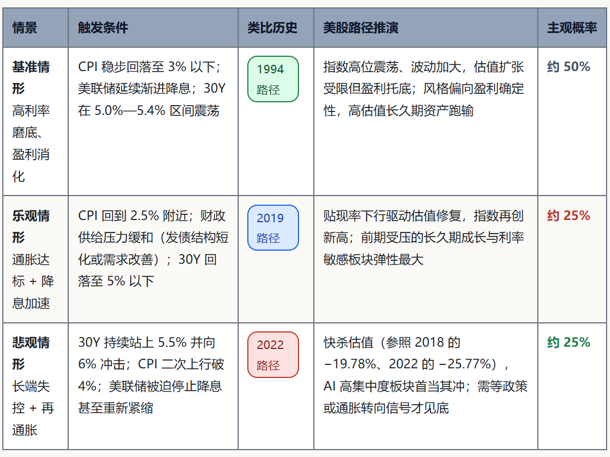

今年中报，有很多指标是在疫Q后，全解F以来的第一次拐头向上，昨天推送了作业：[2026中报作业（1）宏观篇~盈利拐点确认](https://mp.weixin.qq.com/s?__biz=Mzk0MTcwMjU1Nw==&mid=2247499886&idx=1&sn=350e21e6a7551d74e95dd0a3a8131369&scene=21#wechat_redirect) 从180+评论来看，不少人看了好几遍，尤其一些不墙的问题是很有深度，从宏观得数据，大家都找到了自己接下来看好和喜欢的方向。

后面根据大家的提问和评论，会推出板块及板块内的细分的作业。争取本周 把中报作业1-3 推送完，中秋前把4-6 推送完。

若有更多的补充，会免费加在这两批里面，只要订阅的都可以看。后面每篇作业（宏观篇没有）争取都有彩蛋，当然6篇中报作业和3篇美债的阅读理解必然会是后面推送彩蛋的强制条件。

今天缩量，看这篇完读和完播高才考虑二更上今天复盘，若依旧低迷，就继续做作业了。

**今日视频1：**

**认知:债务危机1~化债其实只有这四张牌一个人的债务，就是另一个人的资产。当暴风雨到来，财富正通过这四张底牌，无声无息地在人群中重新分配**

**今日视频2：**

**认知:债务危机2~债务不会消失，它只会换一种形式存在。而每一次转移、每一次挣扎的底层，都是不同利益群体的代价互换。看懂并牢记化债这五种底层终局!!!**

**历史不会简单的重复**： 时代、技术、参与者、外部环境全都变了，不会完完整整复刻过去那一幕。同样的事件，放到当下，触发条件、表现形式、结果都会不一样，不能直接照搬旧经验套用到现在。

**但总押着相同的韵脚**： 人性、贪婪恐惧、群体情绪、利益博弈、周期规律这些底层逻辑几乎不变。悲剧、狂热、泡沫、低谷，故事外壳换了，内在的剧本逻辑似曾相识

## 遇事不决，多在历史中找答案：

## [空仓回归前，先做一轮多角度的历史回测](https://mp.weixin.qq.com/s?__biz=Mzk0MTcwMjU1Nw==&mid=2247499500&idx=1&sn=38d984676e6139dddea23c0eff8e4f95&scene=21#wechat_redirect)

##

## [8轮风格切换、6次抱团瓦解：当下在山顶还是山腰？](https://mp.weixin.qq.com/s?__biz=Mzk0MTcwMjU1Nw==&mid=2247498289&idx=1&sn=3e9f7aecc62c3965f8b5646e714a70b9&scene=21#wechat_redirect)

##

## [2000年后历次牛市回调历史回测](https://mp.weixin.qq.com/s?__biz=Mzk0MTcwMjU1Nw==&mid=2247494045&idx=1&sn=e34c8053ba03e78e06fbe61587103ddc&scene=21#wechat_redirect)

##

## [4次月线大行情历史回测](https://mp.weixin.qq.com/s?__biz=Mzk0MTcwMjU1Nw==&mid=2247492796&idx=1&sn=63a0c69dbb39bd5e582f129854f01aec&scene=21#wechat_redirect)

##

## [近15年国庆前后，10月，三季报前行情历史回测](https://mp.weixin.qq.com/s?__biz=Mzk0MTcwMjU1Nw==&mid=2247493192&idx=1&sn=ff89ef92961af20ae4c59cb6cf0cf59c&scene=21#wechat_redirect)

##

## 三篇目录（全）

## 0、先搞懂底层机制：美债收益率是怎么"压"到美股头上的

## 1、四次历史情形的时间定位与总览

## 2、逐轮复盘：宏观全景 → 传导逻辑 → 市场表现 → 后续演化 → 结论影响

## 3、四轮横向对照：共性与差异

## 4、当前局面（2026 年 9 月）：与四轮逐一横向对比

## 5、结论与推演：情景路径、观察指标与风险

## 6、核心结论

## 书接上一回

[美债收益率破顶与股市的走向：四次历史回测与当前局面解析（1）](https://mp.weixin.qq.com/s?__biz=Mzk0MTcwMjU1Nw==&mid=2247499657&idx=1&sn=483504ad181839201777400db9c4d42e&scene=21#wechat_redirect)

[美债收益率破顶与股市的走向：四次历史回测与当前局面解析（2）](https://mp.weixin.qq.com/s?__biz=Mzk0MTcwMjU1Nw==&mid=2247499788&idx=1&sn=9778bba16160f7388cf8a4185ae24d64&scene=21#wechat_redirect)

**四、当前局面（2026 年 9 月）：与四轮逐一横向对比**

### 4.0 当前宏观全景（2024—2026 年，逐年）

**这三年到底发生了什么（这是理解当前局面的关键）：**

**2024 年（通胀回落到 3%，降息启动）：**

CPI 降到 **3.0%**、GDP **+2.4%**，美联储 9 月起降息（FFR 年均 5.14%）。但长端不配合：10Y 年均 **4.21%**，期限利差仍为 **−0.16**。**"政策在降息、长端不下来"**——这就是本轮最反常的特征第一次出现。债务/GDP 已达 **121.4%**。

**2025 年（通胀接近达标，长端反而更高）：**

CPI 进一步降到 **2.7%**，但 10Y 年均值不降反升到 **4.29%**（1 月 13 日曾达 4.79%），期限利差转正（+0.48）。GDP 放缓到 **+2.0%**，失业率小幅升至 4.3%。**通胀下行 + 央行降息，长端却高位徘徊**——说明长端的定价权已经不在"通胀预期"手里了。

**2026 年（再通胀苗头 + 增长放缓）：**

形势逆转—— **能源 CPI 同比 +11.9%**（前两年都是负值），CPI 从 2.7% 回升到 **3.3%**（5 月一度 4.17%）；同时 GDP 放缓到 **+1.8%**，失业率升至 **4.3%**。而美联储仍在降息（FFR 年均 **3.63%**）。10Y 年均 4.40%、2Y 3.90%、利差 +0.50，**30Y 则冲破 5.3%**。债务/GDP 达到 **122.6%**。

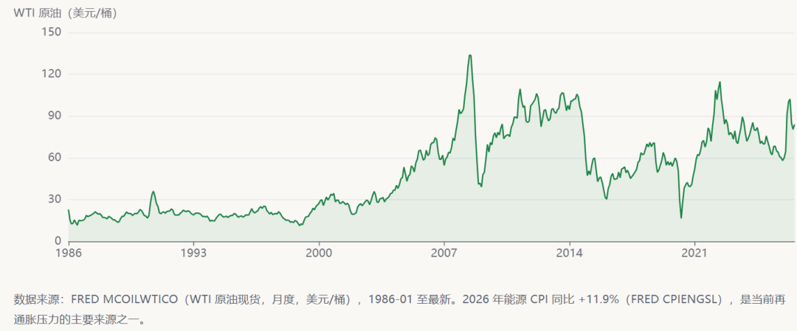

**把三年串起来看，当前的画像非常清晰：****"增长在放缓（GDP 1.8%）+ 通胀在回升（CPI 3.3%、能源 +11.9%）+ 央行却在降息（FFR 3.63%）+ 长端反而冲高（30Y 年内峰值 5.31%、09-03 收盘 5.25%）"**。这是一个四轮历史都没有出现过的组合：**像 2022** 的地方：能源推动的再通胀；**像 1994** 的地方：经济仍在正增长、没有衰退；**像 2018** 的地方：估值偏高、AI 板块高度集中；**四轮都不像**的地方：央行在降息而长端在涨——说明这轮长端的定价权来自**财政供给与期限溢价**，而不是货币政策或通胀预期。

### 4.1 当前长端利率与股市的实际位置（全部锚定 2026-09-03 收盘）

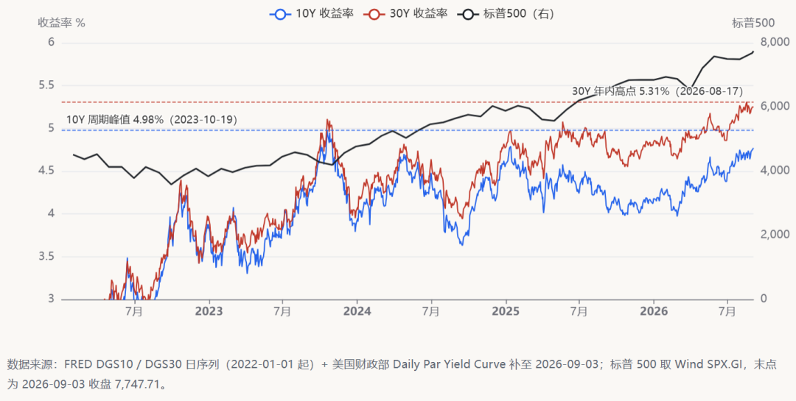

#### 2026-09-03 收盘：美债收益率曲线全貌

为了让"当前"二字没有歧义，下表把 **2026-09-03 同一交易日**的整条美债收益率曲线完整列出。这是本报告所有"当前利率"表述的唯一基准时点。

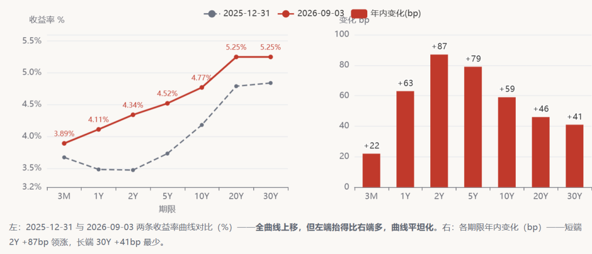

当前长端利率的关键特征：**30Y 于 2026-08-17 冲到 5.31%（2026 年内峰值），09-03 收盘回落至 5.25%**——这个读数上一次出现要回溯到 **2007-07-06 的 5.28%**；而年内峰值 5.31% 的上一次更高读数则要回溯到 **2007-06-12 的 5.35%**，即 2007 年年中。另一头，**10Y 09-03 收盘 4.77%**，仍低于 2023-10-19 的 4.98% 周期峰值，但已是 2026 年内新高（年内峰值 4.77%，2026-09-03）。

**把曲线形态读清楚，是本轮和四轮历史最大的分野。**2026 年以来**全曲线都在上移**，没有哪个期限是下行的——3M 从 3.67% 涨到 3.89%、2Y 从 3.47% 涨到 4.34%、10Y 从 4.18% 涨到 4.77%、30Y 从 4.84% 涨到 5.25%。关键在于**涨得不一样多**：短端涨得最凶（2Y +87bp），长端涨得最少（30Y +41bp）。结果是 2s10s 从 +71bp 收窄到 +43bp、2s30s 从 +137bp 收窄到 +91bp —— 曲线是**「平坦化上行」**，不是陡峭化。
这个形态在说什么？市场并不是在定价"长期通胀失控"（那会让长端领涨、曲线陡峭），而是在**上修美联储的政策路径预期**——2Y 高达 4.34%，比当前政策利率 3.63% 高出 0.71 个百分点，意味着市场认为**降息已经接近尾声、甚至不排除重新收紧**。这与 1981、2022 那种"通胀倒逼全曲线上移并走向倒挂"的形态有本质差别，反而更接近 **2018 年的「政策路径重定价」逻辑**——只不过 2018 年是加息缩表直接推的，本轮是再通胀 + 财政供给让市场不敢再赌降息。

#### 当前的美债 → 美股传导逻辑（同一套四个管道）

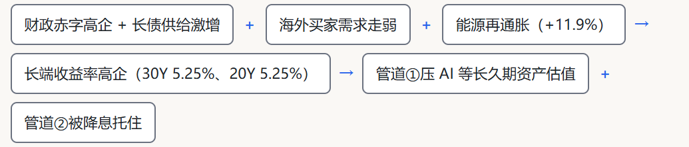

**管道 ① 估值：唯一正在真实承压的管道。**

30Y 破 5.3%、10Y 维持 4.4% 左右，对"现金流在远方"的资产（AI 算力、未盈利成长股）是直接的贴现率压制。这也是当前市场最脆弱的一环：指数权重高度集中在少数 AI 龙头，而这些公司恰恰是久期最长、对折现率最敏感的一类。

**管道 ② 盈利：目前是"托底项"，但有裂缝。**

美联储在降息（FFR 3.63%）为企业融资成本减负，AI 资本开支仍在贡献盈利增量；但 GDP 已放缓至 1.8%、失业率升到 4.3%，**如果增长进一步走弱而通胀又不下来，管道 ② 会从"托底"变成"拖累"——那就是 2022 剧本的开头。**

**管道 ③ 搬家：正在温和发生。**

30Y 给 5.3% 的无风险收益，对养老金、保险等长钱已有吸引力，只是目前股票端仍有 AI 盈利故事支撑，搬家速度不快。

**管道 ④ 杠杆与流动性：暂时平静，但要盯。**

信用利差（BAA−10Y）仅 **1.58**，处于四轮同期的偏低水平（2022 年底 2.27、2018 年底 2.35），说明**目前没有杠杆踩踏迹象**。这是当前与 2018 年 12 月、2022 年 10 月最大的不同，也是判断"还没到恐慌时刻"的最硬证据。

**当前传导的核心判断：**四轮历史里，长端利率上行都由"货币政策周期"驱动，所以央行一转向，长端就跟着下、股市就反转。而本轮长端的推力是**财政供给 + 期限溢价 + 能源再通胀**，**央行降息并不必然压得下长端**——这就是"降息还在继续、30Y 却创新高"的原因。**由此得到一个与历史不同的结论：本轮不能简单套用"政策转向 = 股市反转"。反转的真正前提变成了两个——要么财政供给压力缓和（长端自发回落），要么通胀重新回到 3% 以下的明确下行通道。**

### 4.2 用同一套框架给当下做诊断（2026-09-03 收盘）

现在把第零章建立的那套双因子框架，原封不动地套到当下。先看六个指数的实时位置：

**第一步 · 广度：这不是一场全局冲击，而是结构性冲击。**标普（0.0%）、道指（0.0%）、纳指（−1.4%）仍贴在高点上，而费半（−20.3%）、韩国（−22.4%）、日经（−8.3%）已经明显回落。**六个市场没有同步**——按规则二，这说明冲击目前仍是**结构性的**，尚未扩散到全局。**但这也意味着：指数层面的平静，是由少数权重股撑起来的，不代表风险已经释放。**

**第二步 · 久期梯度：完美成立，而且极端到值得警惕。**把「距区间高点」按久期排列：道指 **0.0%** → 标普 **0.0%** → 纳指 **−1.4%** → 费半 **−20.3%**。**道指到费半的价差高达 20.3 个百分点。**

**这个数字必须和历史放在一起看才有意义——2022 年那轮完整熊市里，道指 −20.9%、费半 −41.5%，价差是 20.6 个百分点。****也就是说：当前高久期资产相对主板承受的打击（20.3pct），已经与 2022 年熊市最深时的水平（20.6pct）几乎完全一致。差别只在于 2022 年主板自己也跌了 20.9%，而当前主板还站在最高点上。**
按规则一这样解读：价差如此之宽，说明当前跌的主要是分母（贴现率），分子（盈利）尚未受损——这与 5.1 节的四管道体检结论一致（只有管道 ① 承压）。**但反过来看，这也意味着高久期资产已经把"利率维持高位"这件事相当充分地定价了，而主板几乎没有定价。**

**第三步 · 本地变量：韩国跟着费半走，日经居中。**韩国 −22.4% 与费半 −20.3% 高度同步——因为韩国股市半导体权重极高（三星、SK 海力士），**它的久期暴露与费半接近，本地汇率缓冲没能抵消产业久期**，这与 2022 轮的表现一致（韩国 −34.6% vs 费半 −41.5%）。日经 −8.3% 居中，符合它出口企业占比高、受汇率对冲的结构特征。**按规则三，日韩当前的跌幅基本可以由"产业结构久期"解释，暂时看不到额外的本地风险叠加。**

**由此得到一个可以直接用于跟踪的判断：**当前处在**"冲击已充分传导至高久期资产、但主板尚未定价"**的状态。后续只有两条路：**路径一 · 高久期资产企稳**（费半、韩国止跌回升）→ 冲击停留在结构性层面，主板无恙，这更像 1994 年"增长型"结局；**路径二 · 主板开始跟跌**（标普、道指跌破关键位，**道指→费半价差随之收窄**）→ 说明冲击从"局部"扩散为"全局"，此时性质就变了，参照 2022 轮。**所以最值得盯的实时指标不是标普 500，而是"道指与费半的回撤价差"**：它现在 20.3pct（宽 = 结构性、分子健康），**一旦这个价差开始收窄，就说明主板正在补跌，是冲击升级的确认信号。**反之，若费半企稳、价差维持或走阔，则是风险可控的信号。

**一个更灵敏的短周期佐证：**9 月头三个交易日，标普 +0.80%、道指 +0.94%、纳指 +0.81% 在涨，而费半 −1.59%、日经 −3.16%、韩国 −3.53% 在跌。**背离在三天的时间尺度上同样存在**，说明这轮分化不是长期趋势的噪音，而是当下正在发生的事。

### 4.3 当前 vs 四轮：逐条对比矩阵

### 4.4 三项四轮都没有的新变量

**债务存量量级不同：**

联邦债务 39.07 万亿美元（FRED GFDEBTN，2026-01-01）。用户提供原文口径为"突破 40 万亿"，FRED 季度序列目前更新至 2026-01-01 的 39.07 万亿，尚未见 40 万亿读数 —— **该数字需以原文口径另行核实**。但无论 39 还是 40 万亿，存量滚动压力对高利率的敏感度都显著高于四轮历史时期。

**利息支出刚性：**

高利率维持越久，利息支出对财政空间的挤压越重，反过来又推升长端供给溢价，形成自我强化。

**市场结构更脆弱：**

美股 AI 赛道高度集中的抱团与杠杆，使指数对贴现率变化的敏感度高于历史均值，长端利率一旦持续高位，估值传导速度会快于历史周期。

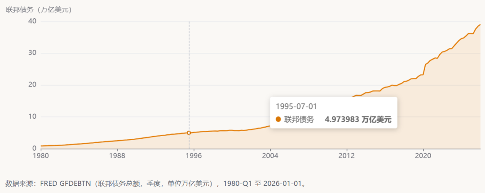

## 五、结论与推演：情景路径、观察指标与风险

### 5.1 最接近的历史情形判定

**结论：当前局面在"宏观组合"上最接近 1994 年（增长温和 + 通胀非失控 + 盈利支撑），在"市场结构"上最接近 2018 年（估值偏高 + 对政策信号高敏感），并叠加四轮都没有的财政/债务变量。**

**像 1994：**

CPI 3.3% 远低于 1981（14.6%）与 2022（9.0%），美联储仍处在降息通道（FFR 3.63%），企业盈利还在上行 —— 这是"增长型"而非"通胀型"的组合。差别在于 1994 年市场相信央行、长端上行被盈利消化；而本轮 **2Y（4.34%）比政策利率（3.63%）高出 0.71pct，市场已经不再相信还有多少降息空间**，这个"信任缺口"是 1994 年没有的。

**像 2018：**

估值处于历史偏高区间、AI 板块高度集中，市场对政策与流动性的边际变化极其敏感；且本轮曲线同样呈**平坦化上行**（2s10s +43bp、2s30s +91bp），一旦压力兑现，调整会以"快杀估值"的形式出现（2018 年 3 个月 −19.78% 即为样本）。

**都不像的地方：**

四轮利率上行的**推力都来自央行**——央行加息直接抬短端，再传导到长端（1981/2022 甚至压出倒挂）。本轮恰恰相反：**央行在降息，收益率却全线上行**（3M→30Y 年内 +41 至 +87bp）。这意味着定价权已经从货币政策转移到**财政供给 + 海外需求走弱 + 期限溢价**——这是四轮样本中从未出现的成因结构。

#### 用四个管道给当前做一次"体检"

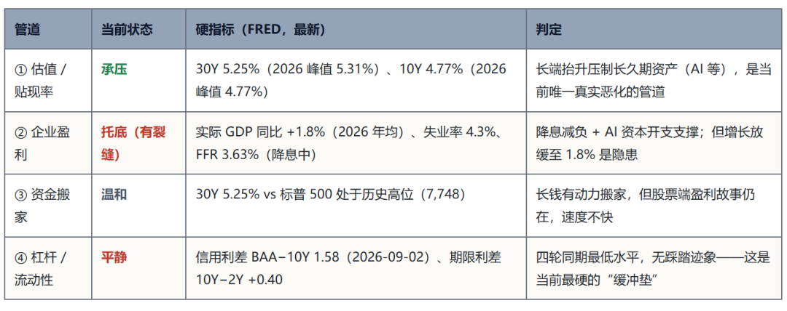

**体检结论：**四个管道里只有**管道 ①（估值）在真实承压**，管道 ②（盈利）仍在托底，管道 ③（搬家）温和，管道 ④（杠杆）平静（信用利差仅 1.58，是四轮同期最低）。**这解释了为什么指数至今没有出现 2018/2022 那样的快速杀跌——因为历史上真正的大跌都需要至少两个管道同时恶化。**

**最关键的前瞻判断：**后续走势取决于**管道 ② 会不会从"托底"翻转为"拖累"**。当前 GDP 已放缓至 1.8%、失业率升至 4.3%、通胀却因能源回升至 3.3%——这是"增长弱 + 通胀黏"的组合。如果通胀继续往上而增长继续往下，就同时具备了 1981（通胀高）与 2022（能源推动）两轮的触发条件，届时管道 ①② 双杀，指数调整幅度将参照 20%—26% 的历史区间。

#### 再补一个维度：市场内部结构给出的独立信号

上面判定的是"宏观组合像谁"。把 4.2 节的六指数诊断并进来，会得到一个**宏观类比没有覆盖到的、方向略有不同的信号**：

**从久期结构看，当前已经在 2022 轮的早期形态里。**

道指→费半的回撤价差已达 **20.3pct**（道指 0.0% vs 费半 −20.3%），**与 2022 年熊市最深时的 20.6pct 几乎完全相同**。也就是说，**高久期资产相对主板承受的打击已经达到"熊市级别"，只是主板自己还没有开始跌。**

**按规则一，价差如此之宽恰恰说明分子（盈利）仍健康、跌的是分母**

——这与上面的四管道体检（仅管道 ① 承压）**互相印证**，是同一件事的两个观测角度。

**这个状态本身是不稳定的。**

四轮历史里，**从未出现过"价差长期维持在 20pct 以上、而主板始终无恙"的样本**：要么高久期资产企稳、主板继续走强（1994 型结局），要么主板补跌、价差随之收窄（2022 型结局）。**当前正处在这两个结局的分岔口上。**

**把两条线索合起来，最终的判定是三层而非两层：****宏观组合****最接近 1994（通胀非失控、盈利仍在上行），****市场结构****最接近 2018（估值高、对政策信号极敏感、曲线平坦化上行），而****资产内部结构****已经呈现 2022 轮的早期特征（高久期资产先跌、主板尚未定价）**。**这三层并不矛盾——它们说的是同一件事的不同侧面：利率冲击已经真实发生并充分传导到了最敏感的地方，但还没有扩散到全局。**因此后续最关键的不是"利率还会不会涨"，而是**这场已经在高久期资产上发生的冲击，会不会扩散到主板**。

### 5.2 三情景推演

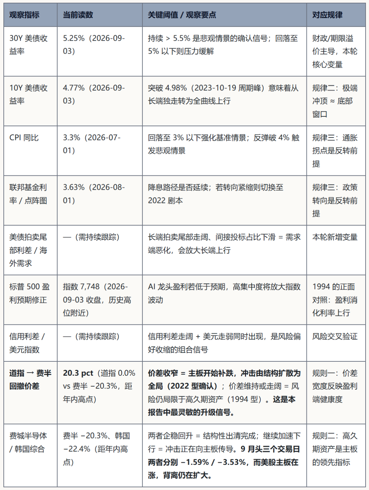

### 5.4 风险提示

**长端失控风险：**

30Y 若持续站上 5.5%，将直接冲击高估值成长板块的贴现率假设，且财政利息负担会进一步恶化，形成"利率上行—供给增加—利率再上行"的负反馈。

**通胀二次抬头风险：**

CPI 同比 2026-05 曾反弹至 4.17%，若再通胀确认，美联储降息路径将被打断，市场会从"1994 剧本"切换到"2022 剧本"。

**集中度风险：**

AI 板块权重集中使指数脆弱性上升，个别龙头盈利不及预期可能触发杠杆去化的连锁反应。

**历史样本局限：**

本报告基于 4 个样本，统计意义有限；且本轮债务结构、市场结构与四轮均不同，历史规律只能作为先验框架，不能机械外推。

**六、大白虎结论**

**1、债券收益率创新高本身不可怕，可怕的是它为什么涨。**

历史上四次10年期美债收益率冲到多年新高，美股的下场差别巨大：1981年跌27%、2022年跌26%，基本算熊市；但1994年几乎没跌（全年才跌1.5%）。区别不在于利率涨了多少，而在于利率为什么涨。

**2、因为经济好而加息 → 股市扛得住；因为通胀失控被迫紧缩 → 股市要大跌。**

1994年利率从5.2%暴力拉到8%，但那是经济强劲背景下的正常加息，标普500全年只跌了1.5%。而1981和2022年都是因为通胀太猛（一个两位数、一个四十年最高）被逼着猛加息，结果都跌了25%以上。

**3、债券收益率飙到极端高点的时候，往往就是美股的阶段性大底。**

1981、2018、2022年这三次，股市的最低点都出现在收益率见顶前后。最典型的是2018年：11月8日美债收益率见顶3.24%，12月24日美股就见底了，前后只差46天。

**4、每次股市由跌转涨，原因都一模一样：通胀见顶了，或者美联储态度转鸽了。**

1982年10月放弃紧缩、2019年1月鲍威尔放软话、2022年底通胀确认回落——三次大反弹全都是踩在这两个信号上。

**4、现在（2026年9月）的局面：像是"1994年增长型"和"2018年政策敏感型"的混合体，但又多了一个以前没有过的麻烦：政府债务和财政问题。怎么判断的？看两个数字：**

30年期美债收益率9月3日收在5.25%（年内最高5.31%），已经创2007年以来新高；

但10年期还在4.77%，没突破2023年10月4.98%的前高。

长债先冲、短债没跟上，这是"市场担心政府借钱太多、发债要付更高利息"（财政/期限溢价问题），不是"通胀失控"那种冲顶。 而且整条收益率曲线都在上移、但短端涨得更多（2年期年内涨87个基点，30年期只涨41个），曲线在变平——说明市场在重新算一笔账：美联储到底还能降息几次？

**5、（这份报告最值钱的一条）：熊市其实已经开始了，只是科技股，没烧到大盘。**

把几个指数按"久期"（简单理解：赚的钱离现在有多远，成长股靠未来、价值股靠现在）排一排，跌的时候顺序永远是固定的：道指跌最少 < 标普 < 纳指 < 费城半导体跌最狠。2022年就是这么个顺序，**道指跌21%，费半跌41.5%，差了20个百分点。**

**而现在的价差已经到了2022年熊市最深时的水平**： 道指还贴在年内最高点（回撤0%），费半已经从高点跌了20.3%——差距正好20.3个百分点，跟2022年最惨的时候一模一样。

翻译过来就是：真正靠"未来赚钱"的股票（半导体、科技股）已经挨了熊市级别的打，但代表传统经济的大盘股还毫发无损地站在山顶上。

接下来最该盯的不是标普500指数本身，而是道指和费半之间的这个"价差",以及债券收益率什么时候飙到极端高点：

1、如果价差开始收窄（费半没再跌、道指开始补跌）→ 说明火已经烧到主板了，局部风险变成全面风险；

2、如果债券收益率什么时候飙到极端高点但费半依旧稳住、价差维持，那么科技有可能继续下一波行情。

**大白话看完，结合今天的视频好好思考**

**以上**

---
原文链接：https://mp.weixin.qq.com/s?__biz=Mzk0MTcwMjU1Nw%3D%3D&mid=2247499894&idx=1&sn=a91dadc1721a4f50bd3ffa0b6f7323d2&chksm=c36a680da7336e98287828471207fc1c830a4629df87003f5582b78e63047ddce2a8dab3d0bc
